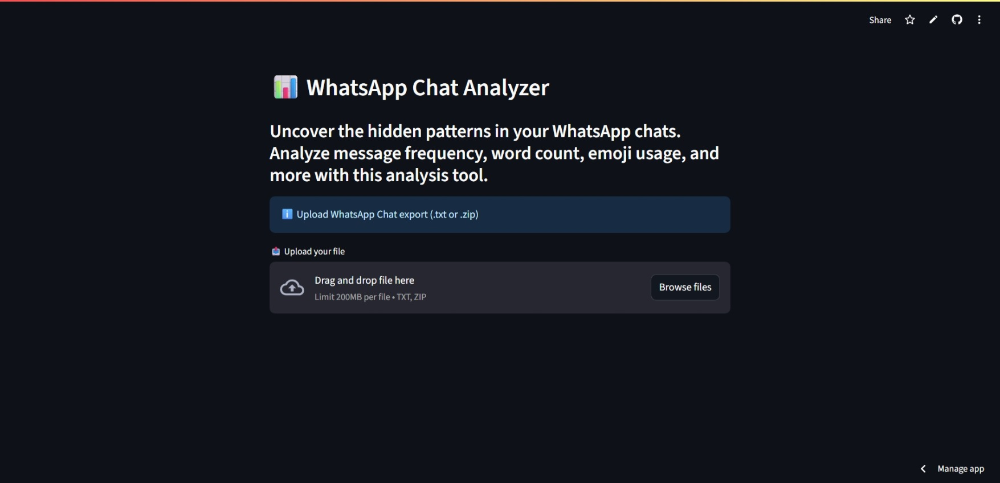
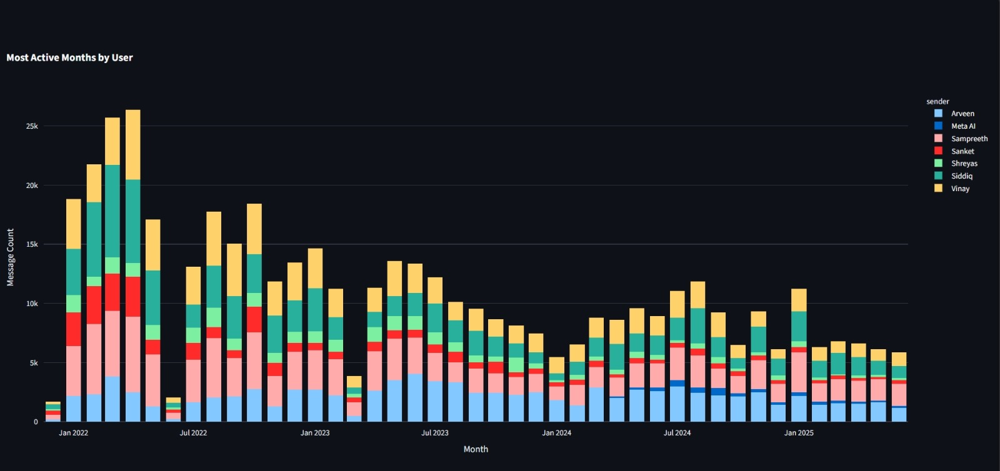
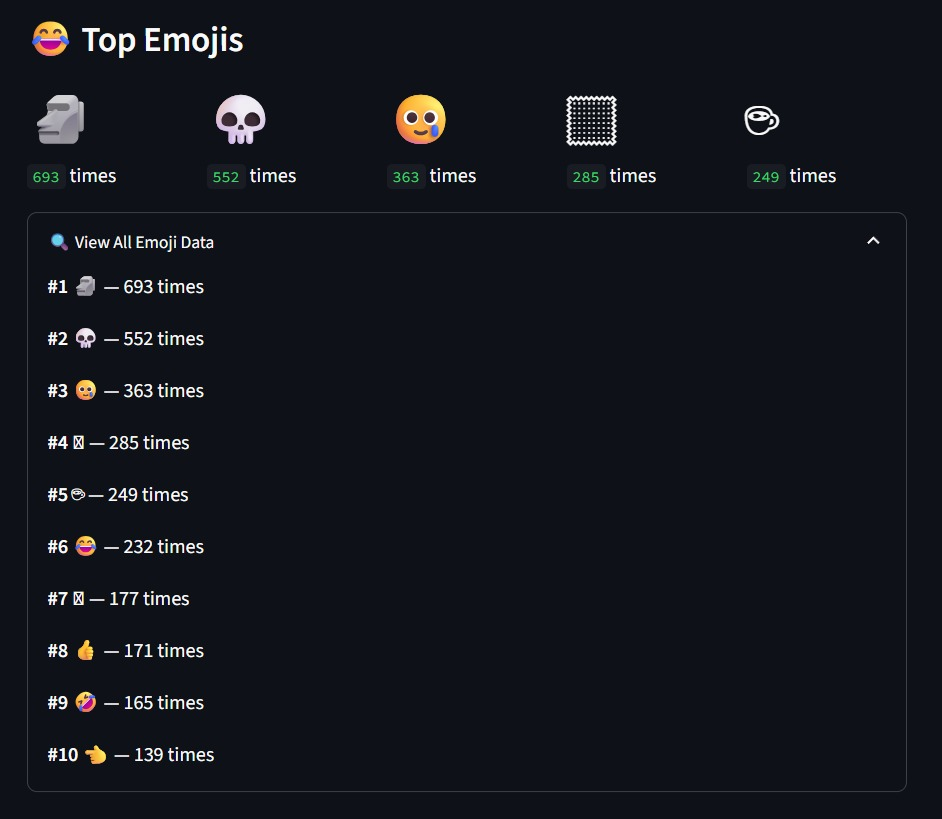
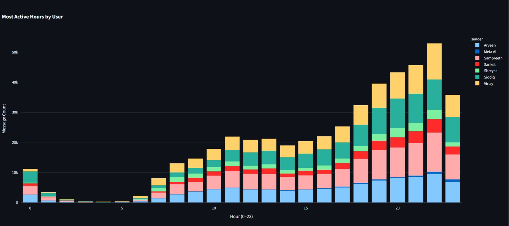

#  WhatsApp Chat Analyzer

Dive deep into your WhatsApp chat data with this interactive, Python-powered Streamlit application. Designed for data enthusiasts and curious users alike, this tool provides a comprehensive suite of visualizations to help you understand your conversations in a new way.


##  Features

-  Monthly & hourly activity charts (stacked by user)
-  Most active users breakdown
-  Top emojis used
-  Word cloud of most common words
-  Average words per message per user
-  Upload `.txt` or `.zip` exported chat file
-  Filter by date and users
-  Expand & Print view for easy export/reporting

##  Visual Previews


⬆️ Landing Page Preview


⬆️ Monthly Stacked Bar Chart


⬆️ Emoji Statistics


⬆️ Hourly Stacked Bar Chart

##  How to Use

1. **Export** your WhatsApp chat as `.txt` or `.zip`.
2. **Launch the app** (locally or via Streamlit Cloud via [URL](https://whatsapp-chat-metrics.streamlit.app/)).
3. **Upload** your file.
4. **Analyze** and explore the interactive visualizations and fiddle with the data.

##  Tech Stack

- [Python 3.9+](https://www.python.org/)
- [Streamlit](https://streamlit.io/)
- [Plotly](https://plotly.com/)
- [Matplotlib](https://matplotlib.org/)
- [WordCloud](https://github.com/amueller/word_cloud)
- [Emoji](https://pypi.org/project/emoji/)
- [Pandas](https://pandas.pydata.org/)

##  Installation

###  Local Setup

```bash
git clone https://github.com/sam-sampreeth/chat-analyzer.git
cd chat-analyzer
pip install -r requirements.txt
streamlit run app.py
